# Lösung zur Fallstudie: Datenintegration und Entwicklung einer MongoDB-Datenbank

Autor: Prof. Dr. Markus Grüne, 2025  

## Aufgabe 1: Synchronisation des Datenmodells der prof-IS-Datenbank mit dem Data Dictionary (60 Minuten)

### Datenbank laden

Öffnen Sie die MySQL-Workbench.  
Anschließend öffnen Sie das Script zum Laden der Datenbank. Die Workbench prompted Sie, die Datei umzukonvertieren. Verwenden Sie in dem Prompt Latin1 als Encoding. Nun sollte das Script fehlerfrei zu lesen sein. Achten Sie auf die Umlaute im Script.  

Erstellen Sie nun zuerst eine Datenbank mit einem Namen z.B. ```wissenschaftliche_Arbeiten```.
Aktivieren Sie die Datenbank mittels Doppelklick. 

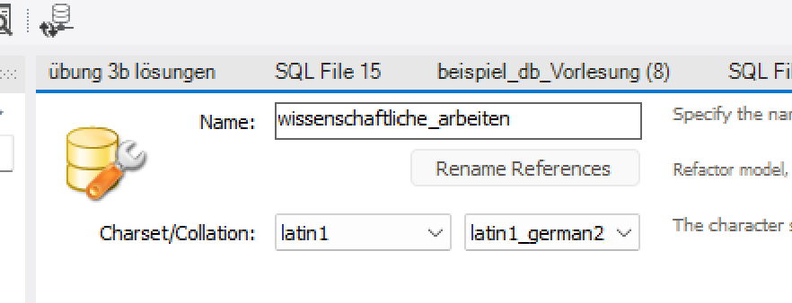

Führen Sie nun das Script gegen die Datenbank aus. Nach einem Refresh in der Workbench sollten die Tabellen zu sehen sein. 
Es kann sein, dass die Tabellen die Umlaute nicht korrekt darstellen. Dann muss das Script geprüft werden. Die set characterset-Befehle können gelöscht werden. Diese sind an mehreren Stellen zu finden.  
Das angepasste File finden Sie [hier](./Inhalte%20nach%20Bearbeitung/dump_zum_laden_angepasst.sql)

### Data Dictionary überarbeiten und MySQL-Datenbank anpassen

Ziel ist es, ein **sauberes Ziel-Datenmodell** zu erzeugen; dies ist die Grundlage für eine solide Anwendungsentwicklung.  

Als erstes lassen wir uns die Tabellendefinitionen der MySQL-Datenbank ausgeben. Hierfür gibt es mehrere Möglichkeiten.  

1) Sie können DESCRIBE verwenden, um einzelne Tabellenschemas anzuzeigen.  
2) Sie können z.B. im Information Schema die Informationen auslesen:

```SQL
SELECT
    TABLE_NAME,
    COLUMN_NAME,
    COLUMN_TYPE,
    IS_NULLABLE,
    COLUMN_KEY,
    COLUMN_DEFAULT,
    EXTRA
FROM
    INFORMATION_SCHEMA.COLUMNS
WHERE
    TABLE_SCHEMA = 'wissenschaftliche_arbeiten';
```

Wir verwenden Nr. 2 und speichern das Ergebnis als CSV-Datei, die wir in Excel bearbeiten und - soweit wie möglich - mit dem  Data Dictionary abgleichen. 

Achtung: Primary Keys können nicht einfach umbenannt werden. 
Bei allen anderen Attributen sollte es keine Probleme geben.

Für die Tabelle "studierende" können z.B. folgende Statements verwendet werden:

```SQL

# Spalten ändern
# fehlt hier, am besten über den Table Inspector

# Spalten hinzufügen
ALTER TABLE studierende 
ADD COLUMN `anrede` VARCHAR(16) NULL AFTER `matrikelnummer`,
ADD COLUMN `strasse` VARCHAR(128) NULL AFTER `email`,
ADD COLUMN `haus_nr` VARCHAR(32) NULL AFTER `strasse`,
ADD COLUMN `adr_hinweis` VARCHAR(256) NULL AFTER `haus_nr`,
ADD COLUMN `plz` VARCHAR(45) NULL AFTER `adr_hinweis`,
ADD COLUMN `ort` VARCHAR(64) NULL AFTER `plz`,
ADD COLUMN `telefon` VARCHAR(32) NULL AFTER `ort`
;

# Den Primary Key umbenennen. 
# Es ist wichtig, dass der ALGORTIHM entsprechend gesetzt wird.

ALTER TABLE studierende
RENAME COLUMN matrikelnummer TO matr_nr,
ALGORITHM=INPLACE;
```

Das Ergebnis des Abgleichs ist hier zu finden:[Tabellenschema nach Änderungen](./Inhalte%20nach%20Bearbeitung/Tabellenschema_nach_Änderungen.csv)

Die gedumpte, mit dem Data Dictionary abgeglichene Datenbank: [hier](./Inhalte%20nach%20Bearbeitung/dump_nach_änderung_latin1_german2_ci.sql)

## Aufgabe 2: Datenimport - dem Wildwuchs ein Ende

Die Professoren haben bisher ihre Daten in unterschiedlichen Formaten gespeichert:

* Einige der Professoren verwenden eine App, die die Daten als JSON-Dokumente ablegt.  
* Eine andere Gruppe von Professoren verwendet Excel als Programm zur Verwaltung der Daten.  
* Wiederum andere arbeiten mit Linux und speichern die Daten in CSV-Formaten.

Die Quellen liegen also als MySQL-Datenbank (diese haben Sie schon geladen), Excel, CSV und in Form von JSON vor:

* [CSV-Datei](CSV-Arbeiten%20zum%20Upload.csv)
* [JSON-Datei](JSON_Datensaetze.json)

Eine mögliche Importstrategie ist die folgende:

1) Wir laden die zu importierenden Dateien und Tabellen in eine Microsoft Excel-Datei.  
2) Anschließend korrigieren wir fehlerhafte Werte oder Probleme der Schlüssel mittels Power Query. Wir ersetzen Daten wie die Professoren mit den entsprechenden Keys, formatieren Datumswerte um ...  
3) Zum Schluss dumpen wir die Daten als CSV  
4) auch das Datenbankschema dumpen wir. 
5) nun versuchen wir uns, mit Hilfe von KI mit dem Datenbankschema und den vorbereiteten Daten INSERT-Statements zu schreiben.  

### MySQL verfügbar machen

Um einen Import aus der MySQL zu ermöglichen, benötigen wir den Connector/J. Excel erwartet eine ODBC-Verbindung.  
Nach der Installation von Connector/J können wir die Tabellen der MySQL-Datenbank importieren. 

Wir legen uns nun eine neue Benutzer-DSN an:
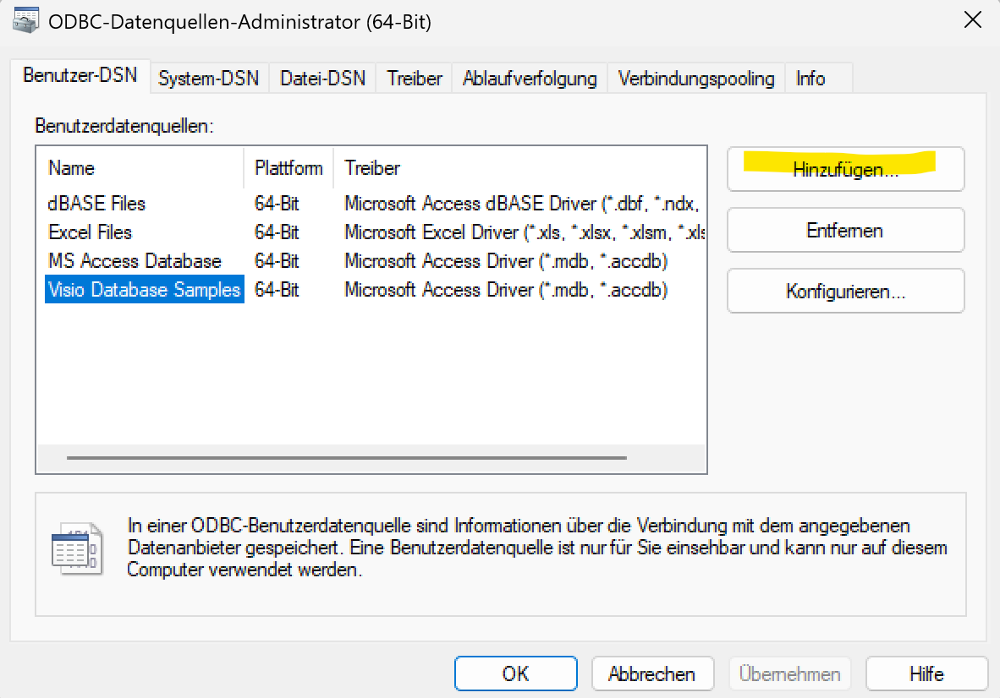

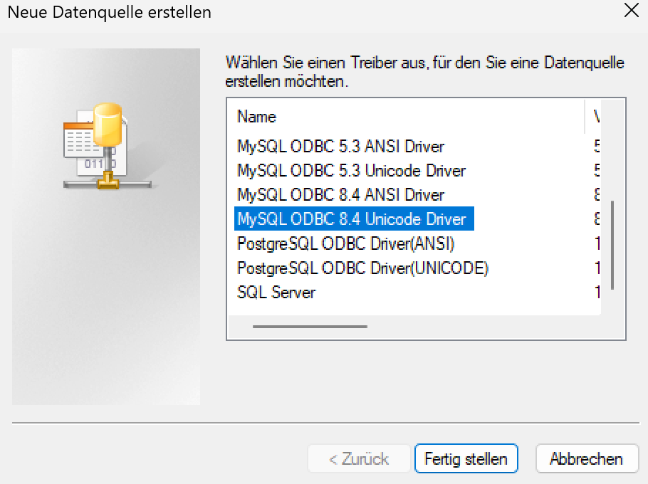

Eine Beispielkonfiguration:

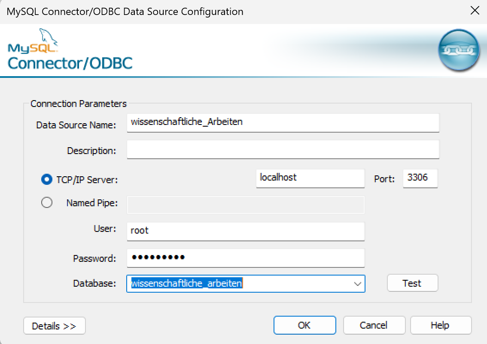

Wir öffnen nun Excel und fügen uns über den Reiter Daten eine ODBC-Quelle hinzu.  

Wir laden jetzt einzeln alle Tabellen aus der ODBC-Quelle bzw. durch die direkte Schnittstelle zur MySQL.  
Im Anschluss fügen wir jede Tabelle dem Excel-Datenmodell hinzu. Dies ermöglicht uns die Arbeit in PowerPivot.  
Bitte beachten Sie: gegebenenfalls müssen Sie PowerPivot erst in Excel sichtbar machen (Com-Addin).

Im Anschluss erstellen wir noch die Foreign Key Beziehungen in Excel. (nicht unbedingt notwendig)
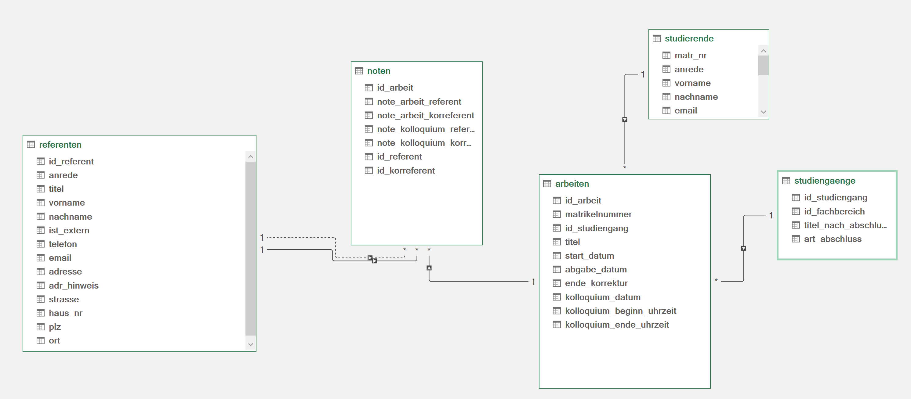

### Nacharbeiten im Abfrageeditor

Leider sind die Kodierungen der Datenbank wahrscheinlich nicht richtig erkannt worden. Wir ändern daher im Abfrageeditor für jeden falschen Buchstaben den Wert.  

Das Ergebnis der Konvertierung könnte so aussehen:
HIER BILD EINFÜGEN!!!

Die CVS-Datei als Ergebnis:
[ETL-CSV-nach-Änderung](./Inhalte%20nach%20Bearbeitung/ETL_Ergebnis.csv)

```
matr_nr;email;anrede;vorname;nachname;id_erstprüfer;id_zweitprüfer;id_studiengang;Titel;start_datum;abgabe_datum;kolloquium_datum;Beginn Kolloquium;Ende Kolloquium
1029384756;anna.meier@stud.uni.de;Frau;Anna;Meier;14;7;17;Künstliche Intelligenz in der Logistik 4.0;23.01.2025;05.05.2025;28.05.2025;09:30:00;10:15:00
2583691470;ben.lehmann@stud.uni.de;Herr;Ben;Lehmann;14;7;70;Einfluss von Social Media auf politische Meinungsbildung;02.02.2025;08.05.2025;01.05.2025;14:30:00;15:15:00
2468135790;lea.schulz@stud.uni.de;Frau;Lea;Schulz;13;7;40;Optimierung von Finanzportfolios durch Maschinelles Lernen;07.03.2025;20.06.2025;15.05.2025;14:00:00;14:30:00
5310864297;emily.hartmann@stud.uni.de;Frau;Emily;Hartmann;5;7;68;Digitale Transformation in der Sozialen Arbeit;20.02.2025;03.06.2025;29.05.2025;09:00:00;09:55:00
9753108642;david.schmidt@stud.uni.de;Herr;David;Schmidt;14;5;29;Additive Fertigungstechnologien in der Automobilindustrie;10.03.2025;25.04.2025;17.04.2025;11:30:00;12:10:00
9876543210;max.mustermann@stud.uni.de;Herr;Max;Mustermann;7;5;47;Nachhaltige Geschäftsmodelle in der Kreislaufwirtschaft;15.02.2025;10.06.2025;02.06.2025;11:00:00;11:45:00
8642097531;sophia.weber@stud.uni.de;Frau;Sophia;Weber;7;13;58;Resilienz in globalen Lieferketten: Eine Fallstudie;01.02.2025;18.06.2025;10.06.2025;13:00:00;13:40:00
1357924680;fabian.mueller@stud.uni.de;Herr;Fabian;Müller;5;14;22;Entwicklung eines autonomen Sensorsystems für Smart Homes;28.01.2025;12.05.2025;05.06.2025;10:00:00;10:50:00
7531086429;lucas.koch@stud.uni.de;Herr;Lucas;Koch;13;14;54;Strategische Entscheidungen unter Unsicherheit;05.01.2025;15.05.2025;08.05.2025;15:00:00;15:35:00
1472583690;clara.fischer@stud.uni.de;Frau;Clara;Fischer;7;5;60;Big Data Analyse im Gesundheitswesen;12.03.2025;27.06.2025;20.06.2025;10:30:00;11:00:00
```

Der DUMP des Datenbankschemas kann mit folgendem Befehl erstellt werden:
``` 
mysqldump -u root -p wissenschaftliche_arbeiten --no-data --skip-triggers --skip-routines --skip-events > schema-wiss-arbeiten.sql
```

Nach Bereinigung sieht das SQL-Schema der DB wie folgt aus:
``` SQL
-- MySQL dump 10.13 Distrib 8.0.42, for Win64 (x86_64)
--
-- Host: localhost Database: wissenschaftliche_arbeiten
-- ------------------------------------------------------
-- Server version 8.0.42

/*!40103 SET @OLD_TIME_ZONE=@@TIME_ZONE */;
/*!40103 SET TIME_ZONE='+00:00' */;
/*!40014 SET @OLD_UNIQUE_CHECKS=@@UNIQUE_CHECKS, UNIQUE_CHECKS=0 */;
/*!40014 SET @OLD_FOREIGN_KEY_CHECKS=@@FOREIGN_KEY_CHECKS, FOREIGN_KEY_CHECKS=0 */;
/*!40101 SET @OLD_SQL_MODE=@@SQL_MODE, SQL_MODE='NO_AUTO_VALUE_ON_ZERO' */;
/*!40111 SET @OLD_SQL_NOTES=@@SQL_NOTES, SQL_NOTES=0 */;

--
-- Table structure for table `arbeiten`
--

DROP TABLE IF EXISTS `arbeiten`;
CREATE TABLE `arbeiten` (
  `id_arbeit` int NOT NULL,
  `matrikelnummer` bigint NOT NULL,
  `id_studiengang` int NOT NULL,
  `titel` varchar(256) DEFAULT NULL,
  `start_datum` date DEFAULT NULL,
  `abgabe_datum` date DEFAULT NULL,
  `ende_korrektur` date DEFAULT NULL,
  `kolloquium_datum` date DEFAULT NULL,
  `kolloquium_beginn_uhrzeit` time DEFAULT NULL,
  `kolloquium_ende_uhrzeit` time DEFAULT NULL,
  PRIMARY KEY (`id_arbeit`),
  KEY `fk_Arbeiten_Studierende_idx` (`matrikelnummer`),
  KEY `fk_Arbeiten_Studiengaenge1_idx` (`id_studiengang`),
  CONSTRAINT `fk_Arbeiten_Studiengaenge1` FOREIGN KEY (`id_studiengang`) REFERENCES `studiengaenge` (`id_studiengang`),
  CONSTRAINT `fk_Arbeiten_Studierende` FOREIGN KEY (`matrikelnummer`) REFERENCES `studierende` (`matr_nr`)
) ENGINE=InnoDB;

--
-- Table structure for table `fachbereiche`
--

DROP TABLE IF EXISTS `fachbereiche`;
CREATE TABLE `fachbereiche` (
  `id_fachbereich` int NOT NULL,
  `name_fachbereich` varchar(128) NOT NULL,
  PRIMARY KEY (`id_fachbereich`)
) ENGINE=InnoDB;

--
-- Table structure for table `noten`
--

DROP TABLE IF EXISTS `noten`;
CREATE TABLE `noten` (
  `id_arbeit` int NOT NULL,
  `note_arbeit_referent` decimal(2,1) DEFAULT NULL,
  `note_arbeit_korreferent` decimal(2,1) DEFAULT NULL,
  `note_kolloquium_referent` decimal(2,1) DEFAULT NULL,
  `note_kolloquium_korreferent` decimal(2,1) DEFAULT NULL,
  `id_referent` int NOT NULL,
  `id_korreferent` int NOT NULL,
  PRIMARY KEY (`id_arbeit`),
  KEY `fk_Noten_Arbeiten1_idx` (`id_arbeit`),
  KEY `fk_Noten_Referenten1_idx` (`id_referent`),
  KEY `fk_Noten_Referenten2_idx` (`id_korreferent`),
  CONSTRAINT `fk_Noten_Arbeiten1` FOREIGN KEY (`id_arbeit`) REFERENCES `arbeiten` (`id_arbeit`),
  CONSTRAINT `fk_Noten_Referenten1` FOREIGN KEY (`id_referent`) REFERENCES `referenten` (`id_referent`),
  CONSTRAINT `fk_Noten_Referenten2` FOREIGN KEY (`id_korreferent`) REFERENCES `referenten` (`id_referent`)
) ENGINE=InnoDB;

--
-- Table structure for table `referenten`
--

DROP TABLE IF EXISTS `referenten`;
CREATE TABLE `referenten` (
  `id_referent` int NOT NULL,
  `anrede` varchar(16) DEFAULT NULL,
  `titel` varchar(45) DEFAULT NULL,
  `vorname` varchar(128) NOT NULL,
  `nachname` varchar(128) NOT NULL,
  `ist_extern` tinyint NOT NULL,
  `telefon` varchar(32) DEFAULT NULL,
  `email` varchar(128) DEFAULT NULL,
  `adresse` varchar(256) DEFAULT NULL,
  `adr_hinweis` varchar(256) DEFAULT NULL,
  `strasse` varchar(128) DEFAULT NULL,
  `haus_nr` varchar(32) DEFAULT NULL,
  `plz` varchar(32) DEFAULT NULL,
  `ort` varchar(64) DEFAULT NULL,
  PRIMARY KEY (`id_referent`)
) ENGINE=InnoDB;

--
-- Table structure for table `studiengaenge`
--

DROP TABLE IF EXISTS `studiengaenge`;
CREATE TABLE `studiengaenge` (
  `id_studiengang` int NOT NULL,
  `id_fachbereich` int NOT NULL,
  `titel_nach_abschluss` varchar(128) DEFAULT NULL,
  `art_abschluss` varchar(36) DEFAULT NULL,
  PRIMARY KEY (`id_studiengang`),
  KEY `fk_Studiengaenge_Fachbereiche1_idx` (`id_fachbereich`),
  CONSTRAINT `fk_Studiengaenge_Fachbereiche1` FOREIGN KEY (`id_fachbereich`) REFERENCES `fachbereiche` (`id_fachbereich`)
) ENGINE=InnoDB;

--
-- Table structure for table `studierende`
--

DROP TABLE IF EXISTS `studierende`;
CREATE TABLE `studierende` (
  `matr_nr` bigint NOT NULL,
  `anrede` varchar(16) DEFAULT NULL,
  `vorname` varchar(128) DEFAULT NULL,
  `nachname` varchar(128) DEFAULT NULL,
  `email` varchar(128) DEFAULT NULL,
  `strasse` varchar(128) DEFAULT NULL,
  `haus_nr` varchar(32) DEFAULT NULL,
  `adr_hinweis` varchar(256) DEFAULT NULL,
  `plz` varchar(45) DEFAULT NULL,
  `ort` varchar(64) DEFAULT NULL,
  `telefon` varchar(32) DEFAULT NULL,
  `scheinfrei_ja_nein` tinyint DEFAULT NULL,
  `id_studiengang` int DEFAULT NULL,
  PRIMARY KEY (`matr_nr`)
) ENGINE=InnoDB;
/*!40103 SET TIME_ZONE=@OLD_TIME_ZONE */;

/*!40101 SET SQL_MODE=@OLD_SQL_MODE */;
/*!40014 SET FOREIGN_KEY_CHECKS=@OLD_FOREIGN_KEY_CHECKS */;
/*!40014 SET UNIQUE_CHECKS=@OLD_UNIQUE_CHECKS */;
/*!40111 SET SQL_NOTES=@OLD_SQL_NOTES */;

-- Dump completed on 2025-05-31 17:11:26
```

#### Die erste Version zum Einfügen (noch fehlerhaft)

Nach entsprechendem Prompt zur Generierung erhalten wir von Gemini folgendes SQL zum Einfügen der Daten:

```SQL
-- INSERT-Befehle für die Tabelle 'studierende'

INSERT INTO `studierende` (`matr_nr`, `email`, `anrede`, `vorname`, `nachname`, `strasse`, `haus_nr`, `adr_hinweis`, `plz`, `ort`, `telefon`, `scheinfrei_ja_nein`, `id_studiengang`) VALUES
(1029384756, 'anna.meier@stud.uni.de', 'Frau', 'Anna', 'Meier', NULL, NULL, NULL, NULL, NULL, NULL, NULL, 17),
(2583691470, 'ben.lehmann@stud.uni.de', 'Herr', 'Ben', 'Lehmann', NULL, NULL, NULL, NULL, NULL, NULL, NULL, 70),
(2468135790, 'lea.schulz@stud.uni.de', 'Frau', 'Lea', 'Schulz', NULL, NULL, NULL, NULL, NULL, NULL, NULL, 40),
(5310864297, 'emily.hartmann@stud.uni.de', 'Frau', 'Emily', 'Hartmann', NULL, NULL, NULL, NULL, NULL, NULL, NULL, 68),
(9753108642, 'david.schmidt@stud.uni.de', 'Herr', 'David', 'Schmidt', NULL, NULL, NULL, NULL, NULL, NULL, NULL, 29),
(9876543210, 'max.mustermann@stud.uni.de', 'Herr', 'Max', 'Mustermann', NULL, NULL, NULL, NULL, NULL, NULL, NULL, 47),
(8642097531, 'sophia.weber@stud.uni.de', 'Frau', 'Sophia', 'Weber', NULL, NULL, NULL, NULL, NULL, NULL, NULL, 58),
(1357924680, 'fabian.mueller@stud.uni.de', 'Herr', 'Fabian', 'Müller', NULL, NULL, NULL, NULL, NULL, NULL, NULL, 22),
(7531086429, 'lucas.koch@stud.uni.de', 'Herr', 'Lucas', 'Koch', NULL, NULL, NULL, NULL, NULL, NULL, NULL, 54),
(1472583690, 'clara.fischer@stud.uni.de', 'Frau', 'Clara', 'Fischer', NULL, NULL, NULL, NULL, NULL, NULL, NULL, 60);

-- INSERT-Befehle für die Tabelle 'arbeiten'
-- Beachten Sie: id_arbeit wird hier fortlaufend generiert.
-- Wenn id_arbeit AUTO_INCREMENT ist, entfernen Sie 'id_arbeit' aus der Spaltenliste und 'NULL' aus den VALUES.

INSERT INTO `arbeiten` (`id_arbeit`, `matrikelnummer`, `id_studiengang`, `titel`, `start_datum`, `abgabe_datum`, `ende_korrektur`, `kolloquium_datum`, `kolloquium_beginn_uhrzeit`, `kolloquium_ende_uhrzeit`) VALUES
(1, 1029384756, 17, 'Künstliche Intelligenz in der Logistik 4.0', STR_TO_DATE('23.01.2025', '%d.%m.%Y'), STR_TO_DATE('05.05.2025', '%d.%m.%Y'), NULL, STR_TO_DATE('28.05.2025', '%d.%m.%Y'), '09:30:00', '10:15:00'),
(2, 2583691470, 70, 'Einfluss von Social Media auf politische Meinungsbildung', STR_TO_DATE('02.02.2025', '%d.%m.%Y'), STR_TO_DATE('08.05.2025', '%d.%m.%Y'), NULL, STR_TO_DATE('01.05.2025', '%d.%m.%Y'), '14:30:00', '15:15:00'),
(3, 2468135790, 40, 'Optimierung von Finanzportfolios durch Maschinelles Lernen', STR_TO_DATE('07.03.2025', '%d.%m.%Y'), STR_TO_DATE('20.06.2025', '%d.%m.%Y'), NULL, STR_TO_DATE('15.05.2025', '%d.%m.%Y'), '14:00:00', '14:30:00'),
(4, 5310864297, 68, 'Digitale Transformation in der Sozialen Arbeit', STR_TO_DATE('20.02.2025', '%d.%m.%Y'), STR_TO_DATE('03.06.2025', '%d.%m.%Y'), NULL, STR_TO_DATE('29.05.2025', '%d.%m.%Y'), '09:00:00', '09:55:00'),
(5, 9753108642, 29, 'Additive Fertigungstechnologien in der Automobilindustrie', STR_TO_DATE('10.03.2025', '%d.%m.%Y'), STR_TO_DATE('25.04.2025', '%d.%m.%Y'), NULL, STR_TO_DATE('17.04.2025', '%d.%m.%Y'), '11:30:00', '12:10:00'),
(6, 9876543210, 47, 'Nachhaltige Geschäftsmodelle in der Kreislaufwirtschaft', STR_TO_DATE('15.02.2025', '%d.%m.%Y'), STR_TO_DATE('10.06.2025', '%d.%m.%Y'), NULL, STR_TO_DATE('02.06.2025', '%d.%m.%Y'), '11:00:00', '11:45:00'),
(7, 8642097531, 58, 'Resilienz in globalen Lieferketten: Eine Fallstudie', STR_TO_DATE('01.02.2025', '%d.%m.%Y'), STR_TO_DATE('18.06.2025', '%d.%m.%Y'), NULL, STR_TO_DATE('10.06.2025', '%d.%m.%Y'), '13:00:00', '13:40:00'),
(8, 1357924680, 22, 'Entwicklung eines autonomen Sensorsystems für Smart Homes', STR_TO_DATE('28.01.2025', '%d.%m.%Y'), STR_TO_DATE('12.05.2025', '%d.%m.%Y'), NULL, STR_TO_DATE('05.06.2025', '%d.%m.%Y'), '10:00:00', '10:50:00'),
(9, 7531086429, 54, 'Strategische Entscheidungen unter Unsicherheit', STR_TO_DATE('05.01.2025', '%d.%m.%Y'), STR_TO_DATE('15.05.2025', '%d.%m.%Y'), NULL, STR_TO_DATE('08.05.2025', '%d.%m.%Y'), '15:00:00', '15:35:00'),
(10, 1472583690, 60, 'Big Data Analyse im Gesundheitswesen', STR_TO_DATE('12.03.2025', '%d.%m.%Y'), STR_TO_DATE('27.06.2025', '%d.%m.%Y'), NULL, STR_TO_DATE('20.06.2025', '%d.%m.%Y'), '10:30:00', '11:00:00');
```

#### Werte korrigeren, die im Ergebnis noch nicht richtig waren
Die Befehle können so nicht ausgeführt werden, da noch Änderungen vorgenommen werden müssen. 
Mehrere Matrikelnummern passen nicht. Entsprechend wurde der INSERT für Studierende angepasst.

```SQL
INSERT INTO `studierende` (`matr_nr`, `email`, `anrede`, `vorname`, `nachname`, `strasse`, `haus_nr`, `adr_hinweis`, `plz`, `ort`, `telefon`, `scheinfrei_ja_nein`, `id_studiengang`) VALUES
(1029384756, 'anna.meier@stud.uni.de', 'Frau', 'Anna', 'Meier', NULL, NULL, NULL, NULL, NULL, NULL, NULL, 17),
(258369147, 'ben.lehmann@stud.uni.de', 'Herr', 'Ben', 'Lehmann', NULL, NULL, NULL, NULL, NULL, NULL, NULL, 70),
(2468135790, 'lea.schulz@stud.uni.de', 'Frau', 'Lea', 'Schulz', NULL, NULL, NULL, NULL, NULL, NULL, NULL, 40),
(5310864297, 'emily.hartmann@stud.uni.de', 'Frau', 'Emily', 'Hartmann', NULL, NULL, NULL, NULL, NULL, NULL, NULL, 68),
(9753108642, 'david.schmidt@stud.uni.de', 'Herr', 'David', 'Schmidt', NULL, NULL, NULL, NULL, NULL, NULL, NULL, 29),
(987654320, 'max.mustermann@stud.uni.de', 'Herr', 'Max', 'Mustermann', NULL, NULL, NULL, NULL, NULL, NULL, NULL, 47),
(8642097531, 'sophia.weber@stud.uni.de', 'Frau', 'Sophia', 'Weber', NULL, NULL, NULL, NULL, NULL, NULL, NULL, 58),
(1357924680, 'fabian.mueller@stud.uni.de', 'Herr', 'Fabian', 'Müller', NULL, NULL, NULL, NULL, NULL, NULL, NULL, 22),
(7531086429, 'lucas.koch@stud.uni.de', 'Herr', 'Lucas', 'Koch', NULL, NULL, NULL, NULL, NULL, NULL, NULL, 54),
(147258369, 'clara.fischer@stud.uni.de', 'Frau', 'Clara', 'Fischer', NULL, NULL, NULL, NULL, NULL, NULL, NULL, 60);
```

#### Arbeiten einfügen mit richtiger ID

Da die letzte ID der Arbeit 122 ist, fangen wir an, die Arbeiten ab 123 einzufügen. 
Der SQL-Befehl dazu wurde entsprechend angepasst:

```SQL
INSERT INTO `arbeiten` (`id_arbeit`, `matrikelnummer`, `id_studiengang`, `titel`, `start_datum`, `abgabe_datum`, `ende_korrektur`, `kolloquium_datum`, `kolloquium_beginn_uhrzeit`, `kolloquium_ende_uhrzeit`) VALUES
(123, 1029384756, 17, 'Künstliche Intelligenz in der Logistik 4.0', STR_TO_DATE('23.01.2025', '%d.%m.%Y'), STR_TO_DATE('05.05.2025', '%d.%m.%Y'), NULL, STR_TO_DATE('28.05.2025', '%d.%m.%Y'), '09:30:00', '10:15:00'),
(124, 2583691471, 70, 'Einfluss von Social Media auf politische Meinungsbildung', STR_TO_DATE('02.02.2025', '%d.%m.%Y'), STR_TO_DATE('08.05.2025', '%d.%m.%Y'), NULL, STR_TO_DATE('01.05.2025', '%d.%m.%Y'), '14:30:00', '15:15:00'),
(125, 2468135790, 40, 'Optimierung von Finanzportfolios durch Maschinelles Lernen', STR_TO_DATE('07.03.2025', '%d.%m.%Y'), STR_TO_DATE('20.06.2025', '%d.%m.%Y'), NULL, STR_TO_DATE('15.05.2025', '%d.%m.%Y'), '14:00:00', '14:30:00'),
(126, 5310864297, 68, 'Digitale Transformation in der Sozialen Arbeit', STR_TO_DATE('20.02.2025', '%d.%m.%Y'), STR_TO_DATE('03.06.2025', '%d.%m.%Y'), NULL, STR_TO_DATE('29.05.2025', '%d.%m.%Y'), '09:00:00', '09:55:00'),
(127, 9753108642, 29, 'Additive Fertigungstechnologien in der Automobilindustrie', STR_TO_DATE('10.03.2025', '%d.%m.%Y'), STR_TO_DATE('25.04.2025', '%d.%m.%Y'), NULL, STR_TO_DATE('17.04.2025', '%d.%m.%Y'), '11:30:00', '12:10:00'),
(128, 9876543210, 47, 'Nachhaltige Geschäftsmodelle in der Kreislaufwirtschaft', STR_TO_DATE('15.02.2025', '%d.%m.%Y'), STR_TO_DATE('10.06.2025', '%d.%m.%Y'), NULL, STR_TO_DATE('02.06.2025', '%d.%m.%Y'), '11:00:00', '11:45:00'),
(129, 8642097531, 58, 'Resilienz in globalen Lieferketten: Eine Fallstudie', STR_TO_DATE('01.02.2025', '%d.%m.%Y'), STR_TO_DATE('18.06.2025', '%d.%m.%Y'), NULL, STR_TO_DATE('10.06.2025', '%d.%m.%Y'), '13:00:00', '13:40:00'),
(130, 1357924680, 22, 'Entwicklung eines autonomen Sensorsystems für Smart Homes', STR_TO_DATE('28.01.2025', '%d.%m.%Y'), STR_TO_DATE('12.05.2025', '%d.%m.%Y'), NULL, STR_TO_DATE('05.06.2025', '%d.%m.%Y'), '10:00:00', '10:50:00'),
(131, 7531086429, 54, 'Strategische Entscheidungen unter Unsicherheit', STR_TO_DATE('05.01.2025', '%d.%m.%Y'), STR_TO_DATE('15.05.2025', '%d.%m.%Y'), NULL, STR_TO_DATE('08.05.2025', '%d.%m.%Y'), '15:00:00', '15:35:00'),
(132, 1472583690, 60, 'Big Data Analyse im Gesundheitswesen', STR_TO_DATE('12.03.2025', '%d.%m.%Y'), STR_TO_DATE('27.06.2025', '%d.%m.%Y'), NULL, STR_TO_DATE('20.06.2025', '%d.%m.%Y'), '10:30:00', '11:00:00');
```

#### Noten-Tabelle einfügen 

Es fehlt noch die Noten-Tabelle, die die Verweise zu den Erst- und Zweitreferenten enthält.  

```SQL
-- INSERT-Befehle für die Tabelle 'noten'
-- id_arbeit wird hier fortlaufend ab 123 verwendet, passend zu den 'arbeiten'-Einträgen.
-- Alle Noten sind NULL, Erst- und Zweitprüfer-IDs sind gesetzt.

INSERT INTO `noten` (`id_arbeit`, `note_arbeit_referent`, `note_arbeit_korreferent`, `note_kolloquium_referent`, `note_kolloquium_korreferent`, `id_referent`, `id_korreferent`) VALUES
(123, NULL, NULL, NULL, NULL, 14, 7),  -- Arbeit von Anna Meier
(124, NULL, NULL, NULL, NULL, 14, 7),  -- Arbeit von Ben Lehmann
(125, NULL, NULL, NULL, NULL, 13, 7),  -- Arbeit von Lea Schulz
(126, NULL, NULL, NULL, NULL, 5, 7),   -- Arbeit von Emily Hartmann
(127, NULL, NULL, NULL, NULL, 14, 5),  -- Arbeit von David Schmidt
(128, NULL, NULL, NULL, NULL, 7, 5),   -- Arbeit von Max Mustermann
(129, NULL, NULL, NULL, NULL, 7, 13),  -- Arbeit von Sophia Weber
(130, NULL, NULL, NULL, NULL, 5, 14),  -- Arbeit von Fabian Müller
(131, NULL, NULL, NULL, NULL, 13, 14), -- Arbeit von Lucas Koch
(132, NULL, NULL, NULL, NULL, 7, 5);   -- Arbeit von Clara Fischer
```

**Die Daten aus dem Excel-Sheet sind nun vollständig in der Datenbank enthalten!***

### JSON-Datei importieren

Auch die Generierung der JSON-Datei bereitet Probleme, da Matrikelnummern bereits belegt sind.  
Wir denken uns neue Matrikelnummern aus (da es sich hier ja nur um ein Beispiel handelt :-).
Anschließend lassen wir uns von einer KI die INSERT-Operationen generieren. 

Das angepasste SQL könnte so aussehen:

```SQL
-- INSERT-Befehle für die Tabelle 'studierende'

INSERT INTO `studierende` (`matr_nr`, `email`, `anrede`, `vorname`, `nachname`) VALUES
('741852963', 'jessica.mayer@stud.uni.de', 'Frau', 'Jessica', 'Mayer'),
('3692581478', 'tim.berger@stud.uni.de', 'Herr', 'Tim', 'Berger'),
('1597534862', 'lara.hoffmann@stud.uni.de', 'Frau', 'Lara', 'Hoffmann'),
('85296374', 'felix.schuster@stud.uni.de', 'Herr', 'Felix', 'Schuster'),
('4862971530', 'mia.richter@stud.uni.de', 'Frau', 'Mia', 'Richter');

-- INSERT-Befehle für die Tabelle 'arbeiten'
-- Die id_arbeit beginnt nun bei 133 und wird fortlaufend erhöht.

INSERT INTO `arbeiten` (`id_arbeit`, `matrikelnummer`, `id_studiengang`, `titel`, `start_datum`, `abgabe_datum`, `ende_korrektur`, `kolloquium_datum`, `kolloquium_beginn_uhrzeit`, `kolloquium_ende_uhrzeit`) VALUES
(133, '741852963', 2, 'Implementierung von Blockchain in der Fertigungsindustrie', STR_TO_DATE('10.01.2025', '%d.%m.%Y'), STR_TO_DATE('25.04.2025', '%d.%m.%Y'), NULL, STR_TO_DATE('15.05.2025', '%d.%m.%Y'), '11:00:00', '11:45:00'),
(134, '3692581478', 3, 'Der Einfluss von Social Media auf das Wahlverhalten junger Erwachsener', STR_TO_DATE('03.02.2025', '%d.%m.%Y'), STR_TO_DATE('18.06.2025', '%d.%m.%Y'), NULL, STR_TO_DATE('10.06.2025', '%d.%m.%Y'), '13:30:00', '14:10:00'),
(135, '1597534862', 2, 'Entwicklung einer energieeffizienten Wasseraufbereitungsanlage für ländliche Gebiete', STR_TO_DATE('28.02.2025', '%d.%m.%Y'), STR_TO_DATE('07.05.2025', '%d.%m.%Y'), NULL, STR_TO_DATE('29.05.2025', '%d.%m.%Y'), '09:00:00', '09:45:00'),
(136, '85296374', 3, 'Risikobewertung von Kryptowährungen mittels stochastischer Modelle', STR_TO_DATE('19.03.2025', '%d.%m.%Y'), STR_TO_DATE('04.06.2025', '%d.%m.%Y'), NULL, STR_TO_DATE('26.06.2025', '%d.%m.%Y'), '14:00:00', '14:30:00'),
(137, '4862971530', 3, 'Effekte von digitalem Lernen auf die kognitive Entwicklung von Kindern', STR_TO_DATE('05.01.2025', '%d.%m.%Y'), STR_TO_DATE('30.04.2025', '%d.%m.%Y'), NULL, STR_TO_DATE('20.05.2025', '%d.%m.%Y'), '10:30:00', '11:20:00');

-- INSERT-Befehle für die Tabelle 'noten'
-- Die id_arbeit beginnt bei 133, entsprechend den Arbeiten aus der JSON-Datei.
-- Noten sind NULL. Erst- und Zweitprüfer-IDs basieren auf der Referentenliste.

INSERT INTO `noten` (`id_arbeit`, `note_arbeit_referent`, `note_arbeit_korreferent`, `note_kolloquium_referent`, `note_kolloquium_korreferent`, `id_referent`, `id_korreferent`) VALUES
(133, NULL, NULL, NULL, NULL, 14, 7),  -- Arbeit von Jessica Mayer: Erstprüfer: Prof. Dr. Severin Schnider (ID 14), Zweitprüfer: Prof. Dr. Markus Roth (ID 7)
(134, NULL, NULL, NULL, NULL, 7, 5),   -- Arbeit von Tim Berger: Erstprüfer: Prof. Dr. Markus Roth (ID 7), Zweitprüfer: Prof. Dr. ing. Dr. hc Anne McMillen (ID 5)
(135, NULL, NULL, NULL, NULL, 5, 13),  -- Arbeit von Lara Hoffmann: Erstprüfer: Prof. Dr. ing. Dr. hc Anne McMillen (ID 5), Zweitprüfer: Prof. Dr. Schuster (ID 13)
(136, NULL, NULL, NULL, NULL, 13, 7),  -- Arbeit von Felix Schuster: Erstprüfer: Prof. Dr. Schuster (ID 13), Zweitprüfer: Prof. Dr. Markus Roth (ID 7)
(137, NULL, NULL, NULL, NULL, 7, 14);  -- Arbeit von Mia Richter: Erstprüfer: Prof. Dr. Markus Roth (ID 7), Zweitprüfer: Prof. Dr. Severin Schnider (ID 14);
```

**Die Daten aus der JSON-Datei sind nun vollständig in der Datenbank enthalten**  

### Hinweise

Die Lösung kann auch vollständig mit KI generiert werden. Ein anderer Ansatz wäre es, der KI einen Dump der Datenbank als Grundlage für die Analyse zu übergeben und dann iterativ zu arbeiten.  
Es ist wichtig, Zeit in die Voranalyse zu stecken. Nur so fällt auf, dass viele der Matrikelnummern doppelt enthalten sind.  

Der vollständige, nachbearbeitete Dump ist hier zu finden: [wissA_dump.sql](./Inhalte%20nach%20Bearbeitung/wissA_dump.sql)

## Aufgabe 3: Transfer in MongoDB

Relational Migrator ist ein Werkzeug zur Migration von Relationalen DBn nach MongoDB. Es ermöglicht die Schematransformation und transferiert auch die Daten.  

Ein Erklärvideo finden Sie auf YouTube:
[How to Migrate from Relational Databases to MongoDB | Relational Migrator 101](https://youtu.be/Z6D5Ge4M2KU?si=5Or50zQ6GtiHT86p)

Folgende Probleme existieren in der aktuellen Version:

1) Nach dem Laden des Datenbank-Treibers akzeptiert der Relational Mapper diesen erst nach einem Neustart des Rechners.  
2) Das Datenbanksystem muss angewiesen werden, UTC als Datumsformat zu verwenden. Dies geht u.a. durch Änderung in der `my.ini`. Alternativ per SQL-Befehl.  

Die Oberfläche ist dann im Web-Browser zu finden:
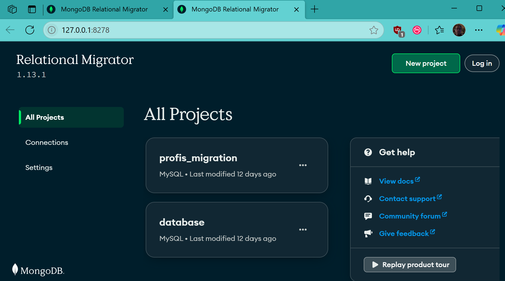

Nun legen wir ein neues Projekt an:
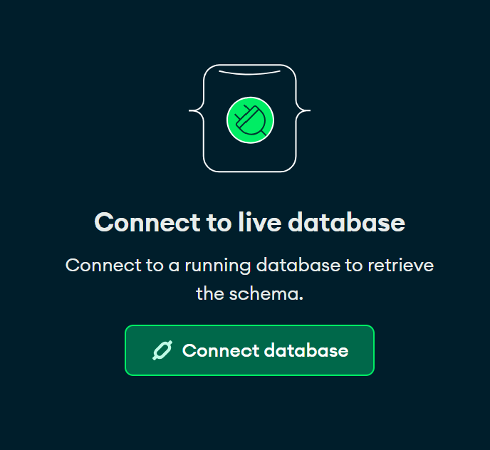

Verbindung mit der MySQL-Datenbank:

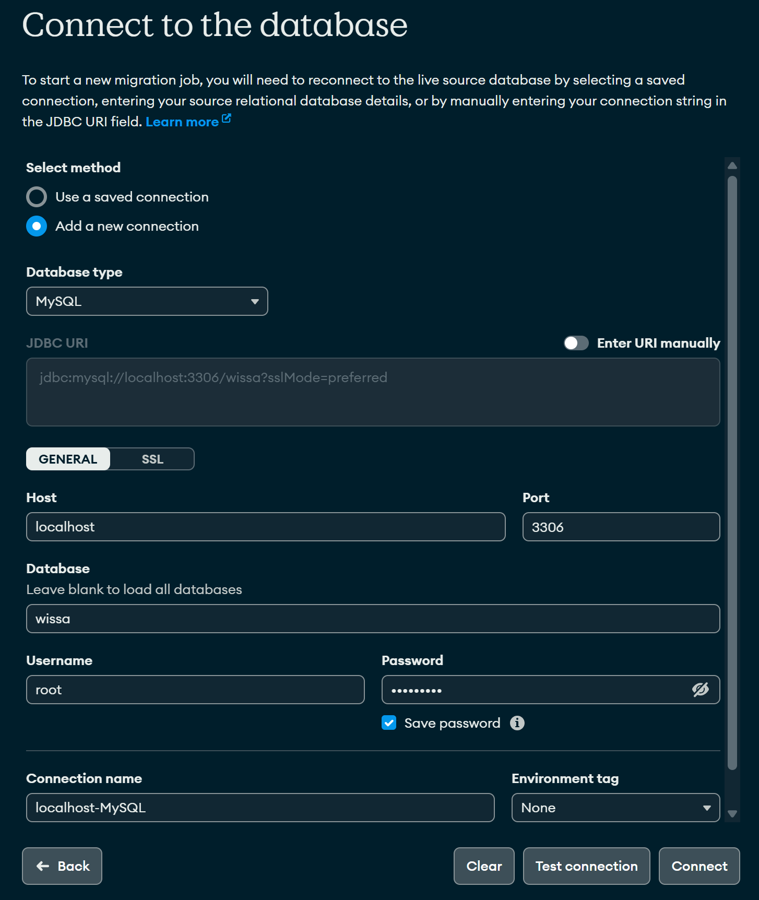

Tabellen laden:

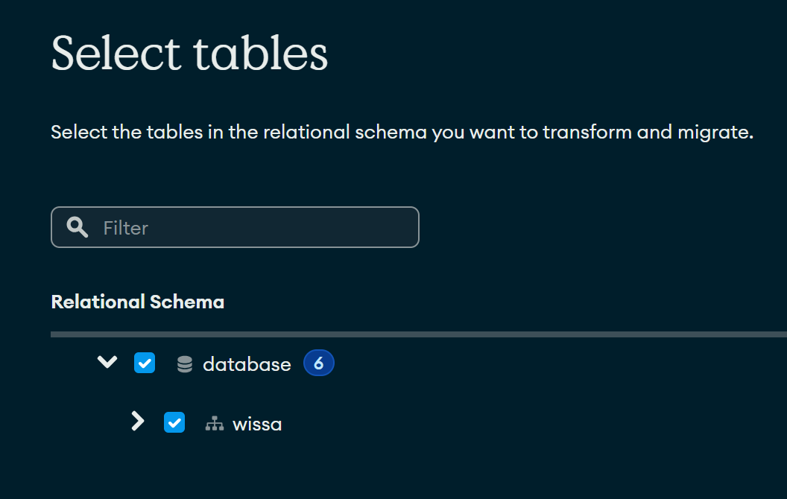

Wir verwenden nun zuerst das recommended Schema:

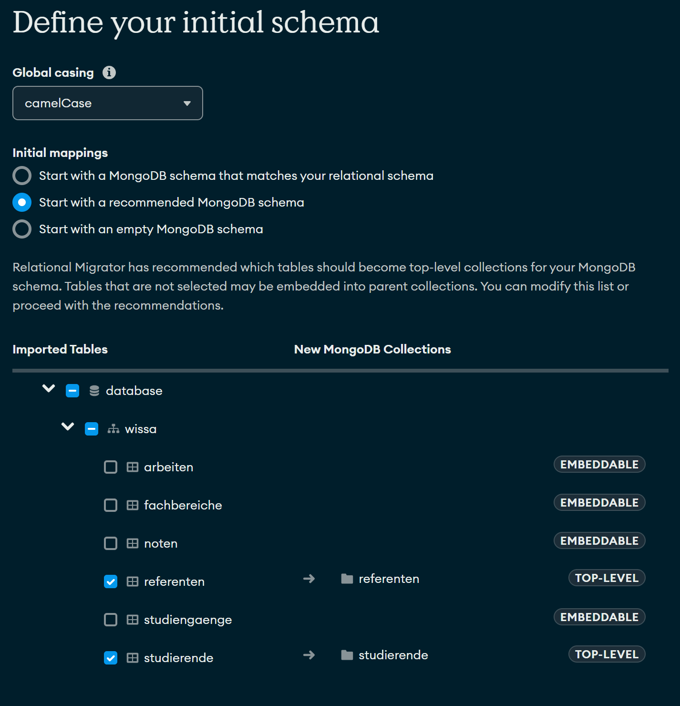

Passen Sie das MDB-Mapping entsprechend so an, dass keine Werte doppelt enthalten sind (z.B. die Matrikelnummer).
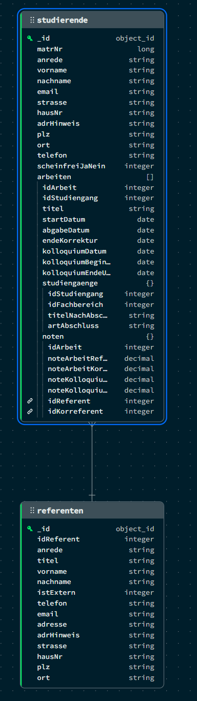

Gehen Sie nun auf `Data Migration` und starten Sie den Migrationsjob.

Wir legen uns nun eine Datenbank an.

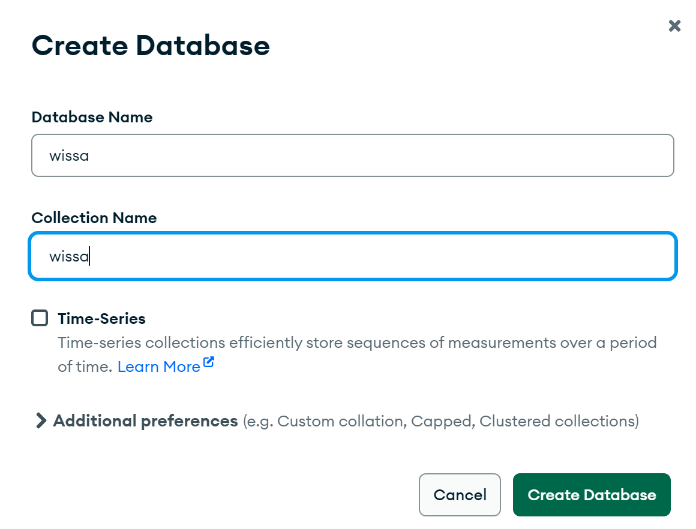

Entsprechend benötigen wir noch einen Admin-User für die Datenbank und collection. Die Datenbank wurde in Atlas angelegt 

```JScript
use wissa;

db.createUser(
   {
      user: "markus",
      pwd: passwordPrompt(), // Fordert zur sicheren Passworteingabe auf
      roles: [
         { role: "dbOwner", db: "wissa" }
      ]
   }
)
```

Passwort merken!


Jetzt Snapshot auswählen

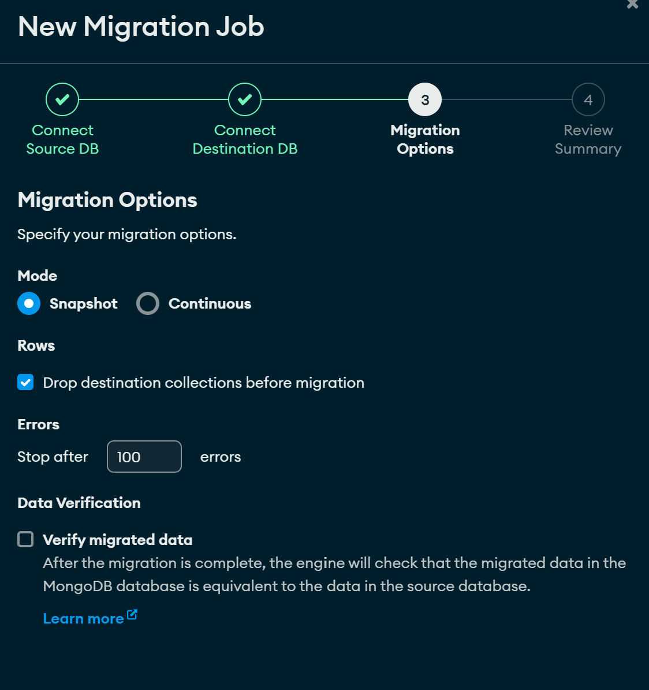

... und Job starten.

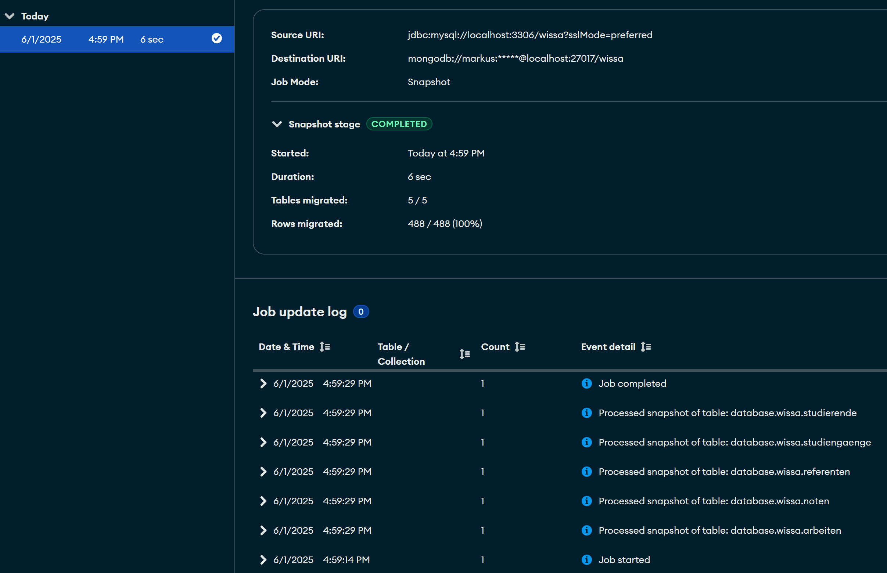

In MongoDB sind nun die Collections enthalten:
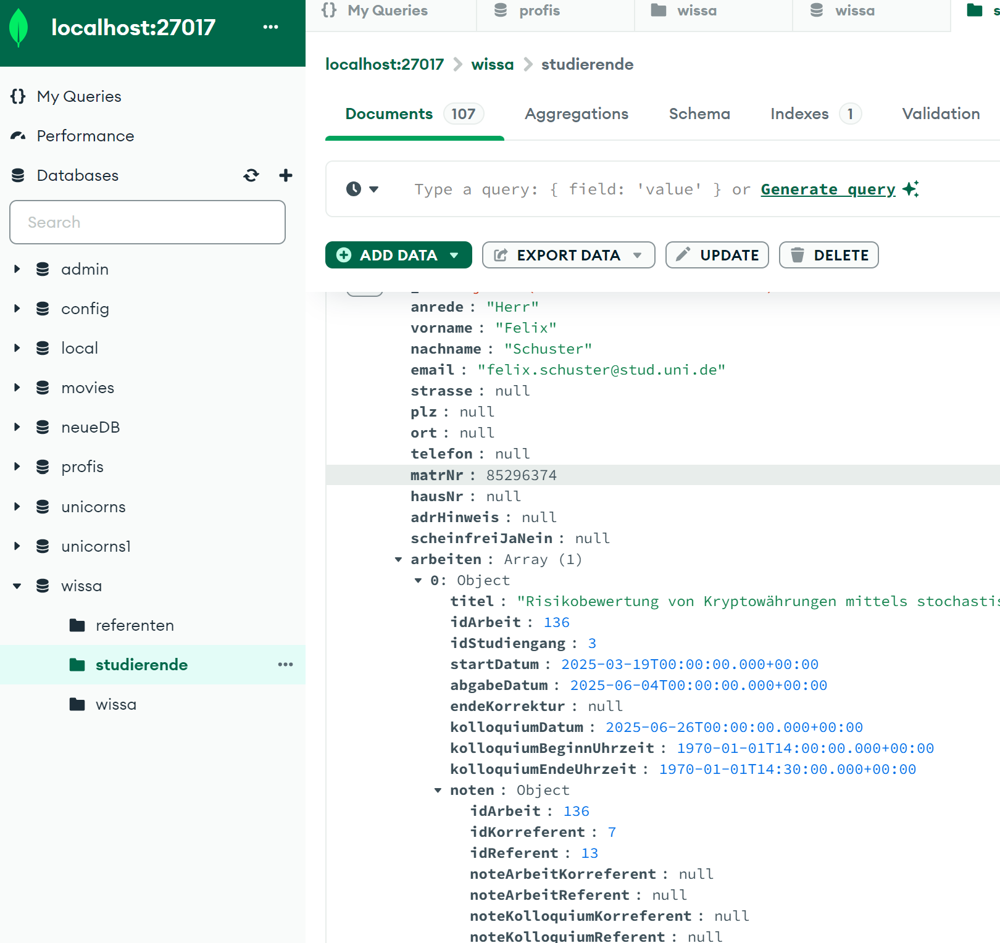